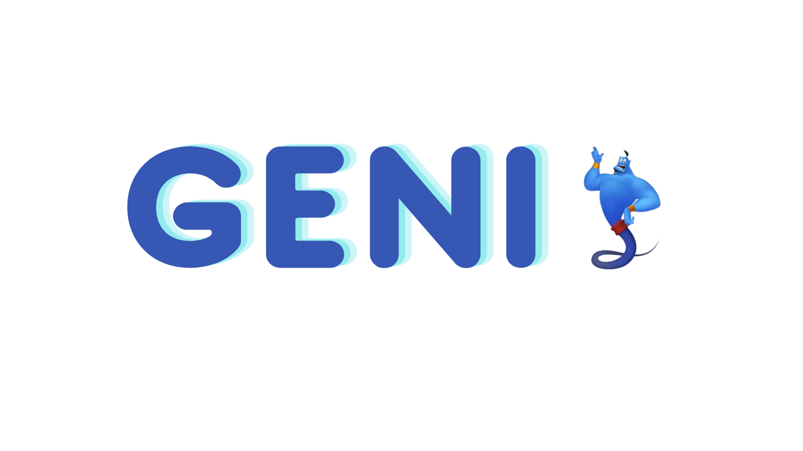

# Geni, the specifications' generator for security tests

Geni is a builder tool that eases the writing of specifications of blockchain smart contracts. These specifications are required to run several auditing services like Foundry or Echidna.

### How Geni would help the EVM ecosystem ? 
Geni generates tests and specifications to build more secure and robust smart contracts on top of any EVM compatible network e.g Aurora, Polygon, Base. 

## Installation
To install Geni, write the following command in your terminal :
`npm i geni-generator`
### Install dependencies

`npm install` OR
`yarn install`

## Demo
Check out the demonstration 
[Watch the demo video](https://youtu.be/kG54qS-K494)
## Deck
[Check our pitch deck](https://docs.google.com/presentation/d/1yQO7OXldsKcUtCneC81B-d56zAjtq0304gge5fb0WKg/edit?usp=sharing)
## Run the tool
Geni can be run locally as shown in this example :
1. `npm i geni-generator`
2. `geni -f  hardhat -t echidna -d ./echidna-exemples/echidna-hh/artifacts/contracts/Lock.sol/`
   
## Configuration
1. your contract build directory ` '-d': '--dir'` 
   1. framework used         `'-f': '--framework'`
     1. generate specification/test for which tool       `'-t': '--tool'`
       1. need help     `'-h': '--help'` 
## Framworks & tools suported
1. Hardhat with Echidna 
2. Foundry
### Request options
Here are the options you need to configure to run the too
## Future work
   
l.

## Credits
Many thanks to Chinmay Agrawal, the ETH Denver Community and the Quantstamp team for supporting us in developping this tool.